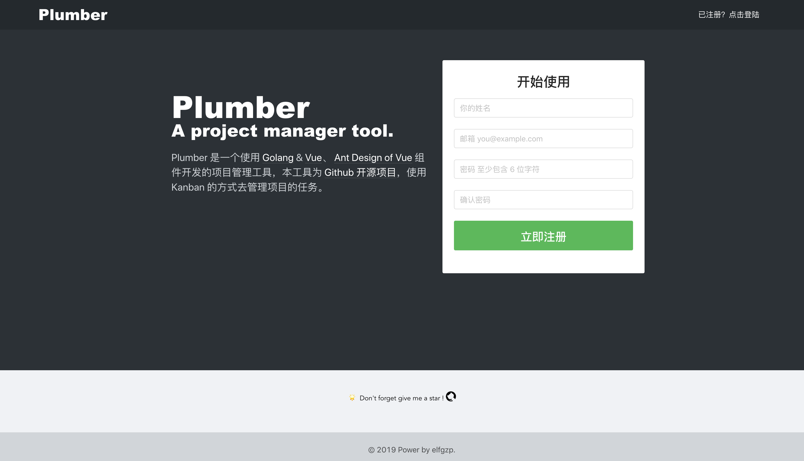

# plumber  
> Project management tool develop by golang  

> Golang 开发的项目管理工具  

后端项目地址：[https://github.com/elfgzp/plumber](https://github.com/elfgzp/plumber)  
前端项目地址：[https://github.com/elfgzp/plumber-front-end](https://github.com/elfgzp/plumber-front-end)  

## 开发进度

### RESTFul 接口  
- [x] 用户接口  
- [x] 用户 Token 接口  
- [x] 团队接口  
- [x] 项目接口  
- [x] 任务列表接口  
- [x] 任务接口  
- [x] 任务检查项接口  
- [ ] 任务评论接口  

### GraphQL 接口  

待 RestFul 接口和前端界面开发完后开发

## 前端开发

- [x] 首页
- [x] 注册表单
- [x] 登陆表单
- [ ] 团队管理 Card
- [ ] 项目管理 Card
- [ ] 项目看板
- [ ] 任务详情
